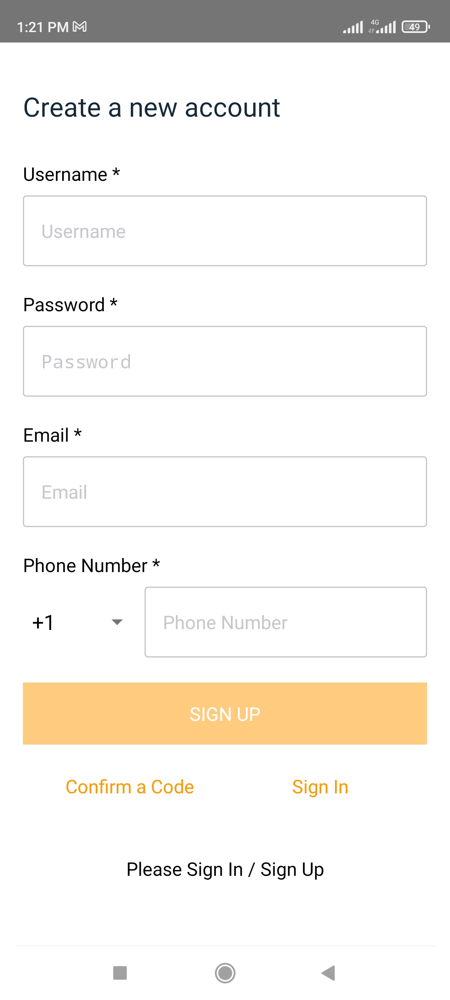
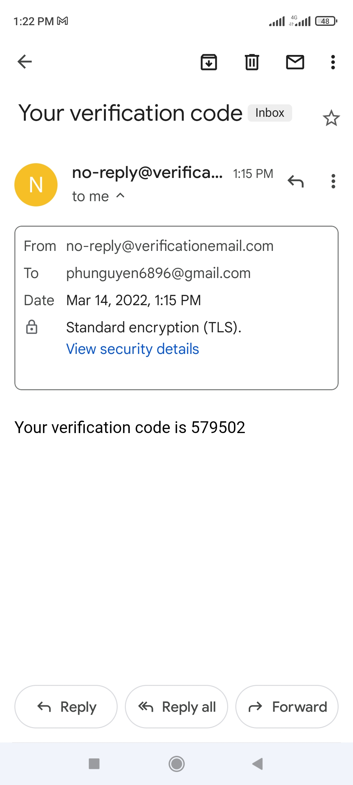
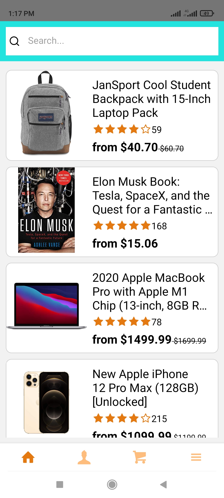
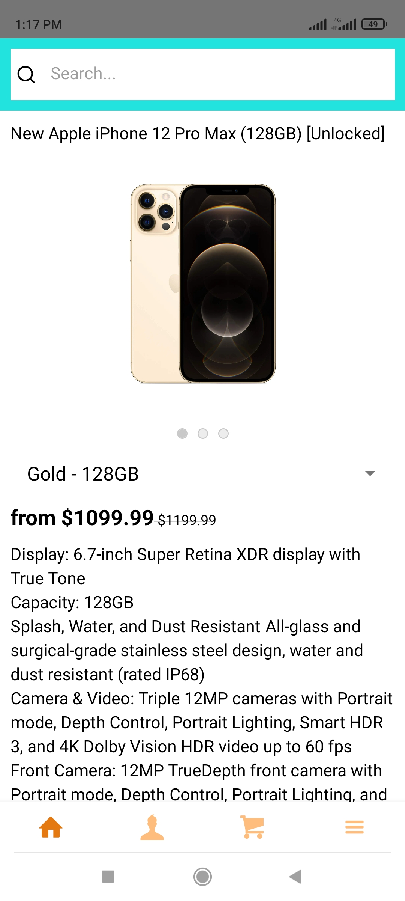
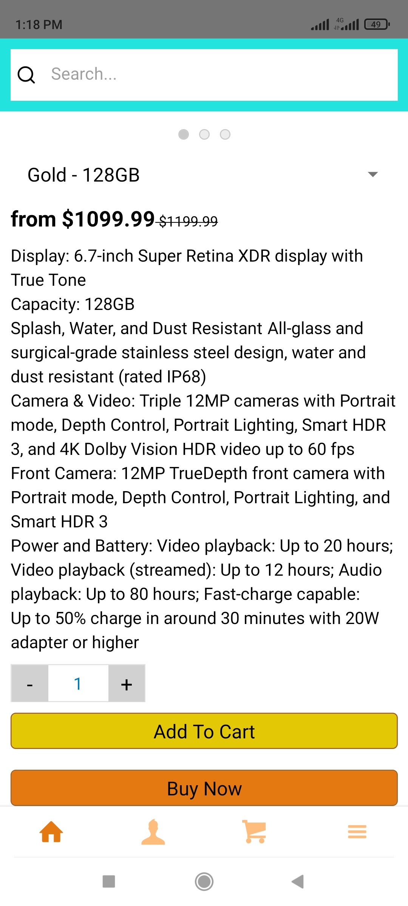
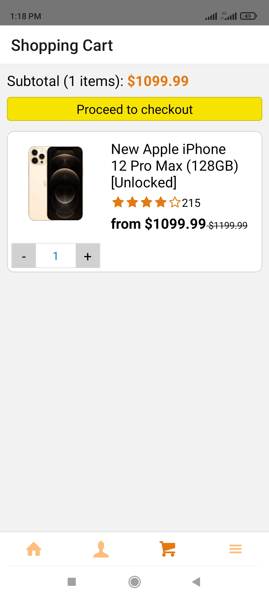

# Ecommerce React Native – AWS Amplify – GraphQL cross-platform mobile application.

# In src folder, create your own aws-exports.js (by AWS Amplify).

Format sample below:
/* eslint-disable */
// WARNING: DO NOT EDIT. This file is automatically generated by AWS Amplify. It will be overwritten.

```
const awsmobile = {
    "aws_project_region": "{placeholder}",
    "aws_cognito_identity_pool_id": "{placeholder}",
    "aws_cognito_region": "{placeholder}",
    "aws_user_pools_id": "{placeholder}",
    "aws_user_pools_web_client_id": "{placeholder}",
    "oauth": {{placeholder}},
    "aws_appsync_graphqlEndpoint": "{placeholder}",
    "aws_appsync_region": "{placeholder}",
    "aws_appsync_authenticationType": "{placeholder}",
    "aws_appsync_apiKey": "{placeholder}",
    "aws_cloud_logic_custom": [
        {
            "name": "{placeholder}",
            "endpoint": "{placeholder}",
            "region": "{placeholder}"
        }
    ]
};

export default awsmobile;
```

# Demo

<br />
<br />
<br />
<br />
<br />
<br />
<br />

